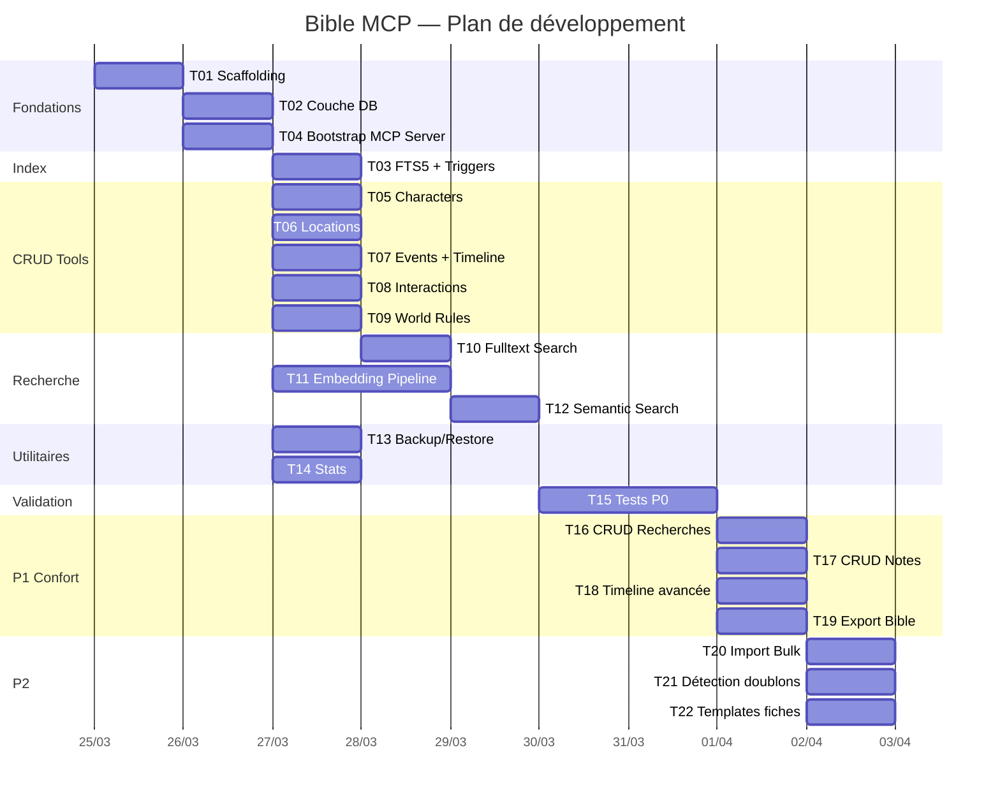

# Plan de développement — mvp

**Date** : 2026-03-25
**Contexte** : architecture-technique.md, stack-technique.md

## Vue d'ensemble

```
┌──────────────────────────────────────────────────┐
│                  CLIENT (Cruchot)                 │
│              LLM + UI + Agent Tools              │
└──────────────────┬───────────────────────────────┘
                   │ stdio (JSON-RPC)
┌──────────────────▼───────────────────────────────┐
│              MCP SERVER (Node.js)                 │
│                                                   │
│  ┌─────────┐ ┌─────────┐ ┌─────────┐ ┌────────┐ │
│  │ Char.   │ │ Loc.    │ │ Events  │ │ Inter. │ │
│  │ Tools   │ │ Tools   │ │ Tools   │ │ Tools  │ │
│  └────┬────┘ └────┬────┘ └────┬────┘ └───┬────┘ │
│       │           │           │           │      │
│  ┌────▼───────────▼───────────▼───────────▼────┐ │
│  │            Service Layer (CRUD)              │ │
│  └────────────────┬────────────────────────────┘ │
│                   │                               │
│  ┌────────────────▼────────────────────────────┐ │
│  │         Drizzle ORM + better-sqlite3        │ │
│  │    ┌──────────┐  ┌──────┐  ┌────────────┐  │ │
│  │    │ Tables   │  │ FTS5 │  │ Embeddings │  │ │
│  │    │ (data)   │  │(idx) │  │  (vectors) │  │ │
│  │    └──────────┘  └──────┘  └────────────┘  │ │
│  └─────────────────────────────────────────────┘ │
│                                                   │
│  ┌─────────────────────────────────────────────┐ │
│  │  HF Transformers (ONNX local)               │ │
│  │  multilingual-e5-small                      │ │
│  └─────────────────────────────────────────────┘ │
│                                                   │
│  [ bible.db ] ◄── fichier unique                 │
└──────────────────────────────────────────────────┘
```

## Structure du projet

```
barda-mcp-ecrivain-bible/
├── src/
│   ├── index.ts                     # Entry point : parse args, init DB, lance server
│   ├── server.ts                    # Server MCP : instanciation, registration tools
│   ├── db/
│   │   ├── index.ts                 # getDb() : connexion, WAL, FK, init FTS
│   │   ├── schema.ts               # Drizzle schema : characters, locations, events, etc.
│   │   ├── fts.ts                   # SQL brut : CREATE VIRTUAL TABLE, triggers
│   │   └── migrations/             # Fichiers .sql générés par drizzle-kit
│   ├── tools/
│   │   ├── index.ts                 # Registre : collecte et exporte tous les tools
│   │   ├── characters.ts           # create/get/update/delete/list_characters
│   │   ├── locations.ts            # create/get/update/delete/list_locations
│   │   ├── events.ts               # create/get/update/delete/list_events + get_timeline
│   │   ├── interactions.ts         # create/get/update/delete/list_interactions + get_character_relations
│   │   ├── world-rules.ts          # create/get/update/delete/list_world_rules
│   │   ├── search.ts               # search_fulltext + search_semantic
│   │   ├── backup.ts               # backup_bible + restore_bible + list_backups
│   │   └── stats.ts                # get_bible_stats
│   ├── embeddings/
│   │   ├── model.ts                # Singleton : chargement pipeline HF Transformers
│   │   ├── index.ts                # generateEmbedding(), indexEntity(), removeEntity()
│   │   └── similarity.ts           # cosineSimilarity(), topK()
│   └── types/
│       └── index.ts                # Types TS partagés
├── data/
│   └── .gitkeep
├── backups/
│   └── .gitkeep
├── tests/
│   ├── setup.ts                    # Setup global : DB en mémoire, fixtures
│   ├── tools/
│   │   ├── characters.test.ts
│   │   ├── locations.test.ts
│   │   ├── events.test.ts
│   │   ├── interactions.test.ts
│   │   ├── world-rules.test.ts
│   │   ├── search.test.ts
│   │   ├── backup.test.ts
│   │   └── stats.test.ts
│   └── embeddings/
│       ├── pipeline.test.ts
│       └── similarity.test.ts
├── package.json
├── tsconfig.json
├── tsup.config.ts
├── drizzle.config.ts
├── vitest.config.ts
├── .eslintrc.cjs
├── .prettierrc
├── .gitignore
├── CLAUDE.md
└── .specs/
```

## Modèle de données

```
characters ──────────┐
  id (PK, UUID)      │
  name (UNIQUE)      │     events ──────────────────┐
  description        │       id (PK, UUID)          │
  traits (JSON)      │       title                  │
  background         │       description            │
  notes              │       chapter                │
  created_at         │       sort_order             │
  updated_at         ├──◄── characters (JSON UUIDs) │
                     │       location_id (FK) ──────┼──► locations
interactions ────────┤       notes                  │      id (PK, UUID)
  id (PK, UUID)      │       created_at             │      name (UNIQUE)
  description        │       updated_at             │      description
  nature             │                              │      atmosphere
  characters (JSON) ─┘                              │      geography
  chapter                                           │      notes
  sort_order         world_rules                    │      created_at
  notes                id (PK, UUID)                │      updated_at
  created_at           category
  updated_at           title                   bible_fts (FTS5)
                       description               entity_type
                       notes                     entity_id
                       created_at                content
                       updated_at
                                               embeddings
                                                 id (PK, UUID)
                                                 entity_type
                                                 entity_id (UNIQUE combo)
                                                 embedding (BLOB)
                                                 content_hash
                                                 created_at
```

## API MCP — Table des tools

### P0 — Core CRUD + Search

| Tool | Description | Inputs clés |
|------|-------------|-------------|
| `create_character` | Crée une fiche personnage | name*, description, traits, background, notes |
| `get_character` | Récupère un personnage par nom ou ID | name \| id |
| `update_character` | Met à jour un personnage | id*, champs à modifier |
| `delete_character` | Supprime un personnage | id* |
| `list_characters` | Liste tous les personnages | limit?, offset? |
| `create_location` | Crée une fiche lieu | name*, description, atmosphere, geography, notes |
| `get_location` | Récupère un lieu | name \| id |
| `update_location` | Met à jour un lieu | id*, champs |
| `delete_location` | Supprime un lieu | id* |
| `list_locations` | Liste tous les lieux | limit?, offset? |
| `create_event` | Crée un événement | title*, description, chapter, characters[], location_id, notes |
| `get_event` | Récupère un événement | id |
| `update_event` | Met à jour un événement | id*, champs |
| `delete_event` | Supprime un événement | id* |
| `list_events` | Liste les événements | limit?, offset? |
| `get_timeline` | Timeline triée par sort_order | — |
| `create_interaction` | Crée une interaction | description*, nature, characters[]*, chapter, notes |
| `get_interaction` | Récupère une interaction | id |
| `update_interaction` | Met à jour une interaction | id*, champs |
| `delete_interaction` | Supprime une interaction | id* |
| `list_interactions` | Liste les interactions | limit?, offset? |
| `get_character_relations` | Relations d'un personnage | character_id* |
| `create_world_rule` | Crée une règle du monde | category*, title*, description*, notes |
| `get_world_rule` | Récupère une règle | id |
| `update_world_rule` | Met à jour une règle | id*, champs |
| `delete_world_rule` | Supprime une règle | id* |
| `list_world_rules` | Liste les règles | category?, limit? |
| `search_fulltext` | Recherche textuelle FTS5 | query*, entity_type?, limit? |
| `search_semantic` | Recherche sémantique par embeddings | query*, entity_type?, limit?, threshold? |
| `backup_bible` | Sauvegarde la bible | label? |
| `restore_bible` | Restaure depuis un backup | backup_path* |
| `list_backups` | Liste les backups disponibles | — |
| `get_bible_stats` | Statistiques de la bible | — |

### P1 — Confort

| Tool | Description |
|------|-------------|
| `create_research` | Crée une note de recherche |
| `get_research` / `update_research` / `delete_research` / `list_research` | CRUD recherches |
| `create_note` / `get_note` / `update_note` / `delete_note` / `list_notes` | CRUD notes libres |
| `get_timeline_filtered` | Timeline filtrée (personnage, lieu, intervalle chapitres) |
| `export_bible` | Export texte lisible de toute la bible |

### P2 — Nice-to-have

| Tool | Description |
|------|-------------|
| `import_bulk` | Import massif depuis JSON |
| `detect_duplicates` | Détection de doublons sémantiques |

## Phases de développement

### P0 — MVP
| # | Tache | Detail |
|---|-------|--------|
| 1 | Scaffolding projet | package.json, tsconfig, tsup, vitest, eslint, prettier, .gitignore, structure dossiers |
| 2 | Couche DB | Connexion SQLite, schema Drizzle, migrations, init WAL+FK |
| 3 | Index FTS5 | Tables virtuelles FTS5, triggers sync INSERT/UPDATE/DELETE |
| 4 | Bootstrap MCP Server | server.ts + index.ts, transport stdio, registry tools pattern |
| 5-9 | CRUD Tools (5 domaines) | Personnages, lieux, événements, interactions, règles — pattern identique |
| 10 | Recherche Fulltext | search_fulltext via FTS5 MATCH |
| 11 | Pipeline Embeddings | Chargement modèle, génération, stockage, cosine similarity |
| 12 | Recherche Sémantique | search_semantic via embeddings + top-K |
| 13 | Backup/Restore | Copie fichier .db, restauration, listing |
| 14 | Stats | Compteurs par type d'entité + taille DB |
| 15 | Tests P0 | Tests unitaires + intégration, couverture CRUD + search |

### P1 — Confort
| # | Tache | Detail |
|---|-------|--------|
| 16 | CRUD Recherches | Même pattern que les autres CRUD |
| 17 | CRUD Notes | Même pattern, avec tags JSON |
| 18 | Timeline avancée | Filtres par personnage, lieu, intervalle chapitres |
| 19 | Export Bible | Dump texte structuré de toute la bible |

### P2 — Nice-to-have
| # | Tache | Detail |
|---|-------|--------|
| 20 | Import Bulk JSON | Validation schema + insertion batch |
| 21 | Détection doublons | Similarité entre fiches existantes |
| 22 | Templates de fiches | Préremplis par genre (fantasy, polar, SF) |

## Tests

### Stratégie
- **Unitaires** : Chaque tool testé individuellement avec DB en mémoire (`:memory:`)
- **Intégration** : Flux complets (create → search → update → search again)
- **Embeddings** : Mocking du modèle HF (vecteurs aléatoires) pour les tests rapides, tests réels optionnels

### Outils
- vitest (runner + assertions)
- DB en mémoire pour isolation totale entre tests
- Fixtures factory pour générer des données de test réalistes

### Tests prioritaires P0
- CRUD complet pour chaque entité (create, read, update, delete, list)
- Unicité des noms (doublon → erreur)
- Recherche fulltext (résultats pertinents, 0 résultats, requête vide)
- Recherche sémantique (top-K, seuil de similarité)
- Backup + restore (intégrité fichier)

## Références MCP

| Etape | MCP | Requete |
|-------|-----|---------|
| T04 | Context7 | @modelcontextprotocol/sdk — Server creation, StdioServerTransport |
| T02 | Context7 | drizzle-orm — SQLite schema, migrations |
| T11 | Context7 | @huggingface/transformers — pipeline, feature-extraction |
| T02 | Context7 | better-sqlite3 — pragma, prepare, transactions |

## Ordre d'execution



## Checklist de lancement
- [ ] Node.js >= 20 installé
- [ ] pnpm installé
- [ ] Vérifier que better-sqlite3 compile sur la machine (node-gyp)
- [ ] Premier lancement : téléchargement modèle E5-small (~130MB, une seule fois)
- [ ] Tester le MCP dans Cruchot via config barda
