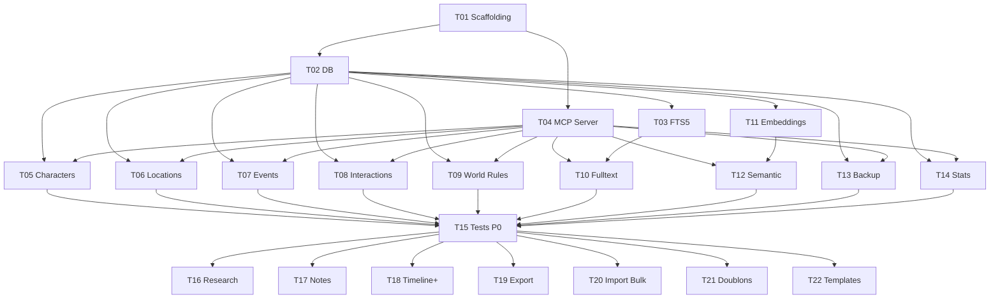

# Taches — mvp

**Date** : 2026-03-25
**Nombre de taches** : 22
**Phases** : P0 (15 taches), P1 (4 taches), P2 (3 taches)

## Taches

### T01 · Scaffolding projet

**Phase** : P0
**But** : Initialiser le projet avec toutes les configs et la structure de dossiers.

**Fichiers concernes** :
- `[NEW]` `package.json`
- `[NEW]` `tsconfig.json`
- `[NEW]` `tsup.config.ts`
- `[NEW]` `vitest.config.ts`
- `[NEW]` `drizzle.config.ts`
- `[NEW]` `.eslintrc.cjs`
- `[NEW]` `.prettierrc`
- `[NEW]` `.gitignore`
- `[NEW]` `src/index.ts` (placeholder)
- `[NEW]` `src/types/index.ts` (placeholder)
- `[NEW]` `data/.gitkeep`
- `[NEW]` `backups/.gitkeep`
- `[NEW]` `tests/setup.ts` (placeholder)

**Piste** : infra

**Dependances** : aucune

**Criteres d'acceptation** :
- [ ] `pnpm install` s'exécute sans erreur
- [ ] `pnpm build` compile le TypeScript sans erreur
- [ ] `pnpm lint` passe
- [ ] Structure de dossiers conforme au plan (src/, tests/, data/, backups/)
- [ ] ESM activé (`"type": "module"` dans package.json)
- [ ] strict mode TypeScript activé

---

### T02 · Couche base de donnees

**Phase** : P0
**But** : Mettre en place la connexion SQLite, le schema Drizzle complet et les migrations.

**Fichiers concernes** :
- `[NEW]` `src/db/index.ts`
- `[NEW]` `src/db/schema.ts`
- `[NEW]` `src/db/migrations/` (generees par drizzle-kit)

**Piste** : backend

**Dependances** : T01

**Criteres d'acceptation** :
- [ ] `getDb(path)` retourne une instance SQLite configurée (WAL, FK ON)
- [ ] Schema Drizzle définit les 7 tables principales + table embeddings
- [ ] Les migrations sont générées et s'appliquent correctement
- [ ] Les UUID sont générés côté applicatif (pas de dépendance SQLite)
- [ ] Les timestamps sont des INTEGER (unix seconds)
- [ ] Les champs JSON (traits, characters, tags, sources) sont TEXT avec sérialisation
- [ ] Un test crée une DB en mémoire et vérifie que toutes les tables existent

---

### T03 · Index FTS5 et triggers

**Phase** : P0
**But** : Créer la table virtuelle FTS5 et les triggers de synchronisation automatique.

**Fichiers concernes** :
- `[NEW]` `src/db/fts.ts`

**Piste** : backend

**Dependances** : T02

**Criteres d'acceptation** :
- [ ] Table virtuelle `bible_fts` créée avec FTS5 (entity_type, entity_id, content)
- [ ] Triggers INSERT sur chaque table principale → insert dans bible_fts (concaténation des champs textuels)
- [ ] Triggers UPDATE → delete + re-insert dans bible_fts
- [ ] Triggers DELETE → delete dans bible_fts
- [ ] `initFts(db)` appelable depuis db/index.ts
- [ ] Test : insertion d'un character → vérifier que la FTS contient l'entrée
- [ ] Test : update → FTS mise à jour
- [ ] Test : delete → FTS nettoyée

---

### T04 · Bootstrap MCP Server

**Phase** : P0
**But** : Créer le serveur MCP avec transport stdio, le registre de tools et l'entry point.

**Fichiers concernes** :
- `[MODIFY]` `src/index.ts`
- `[NEW]` `src/server.ts`
- `[NEW]` `src/tools/index.ts`

**Piste** : backend

**Dependances** : T01

**Criteres d'acceptation** :
- [ ] `Server` MCP instancié avec name="bible-ecrivain" et version depuis package.json
- [ ] `StdioServerTransport` connecté
- [ ] `ListToolsRequestSchema` handler retourne la liste complète des tools enregistrés
- [ ] `CallToolRequestSchema` handler dispatche vers le bon tool
- [ ] Pattern de registration : chaque fichier tools/*.ts exporte un objet `{name, description, inputSchema, handler}`
- [ ] `src/index.ts` : parse les arguments CLI (--db-path optionnel, défaut `data/bible.db`), init DB, lance server
- [ ] Le serveur se lance et répond à `tools/list` (testable manuellement)

---

### T05 · Tools CRUD Personnages

**Phase** : P0
**But** : Implémenter les 5 tools CRUD pour les personnages.

**Fichiers concernes** :
- `[NEW]` `src/tools/characters.ts`
- `[MODIFY]` `src/tools/index.ts` (ajout registration)

**Piste** : backend

**Dependances** : T02, T04

**Criteres d'acceptation** :
- [ ] `create_character` : crée un personnage (name obligatoire), retourne la fiche complète avec ID
- [ ] `get_character` : récupère par name OU id, retourne la fiche complète
- [ ] `update_character` : met à jour les champs fournis, régénère embedding si embeddings actifs
- [ ] `delete_character` : supprime et nettoie FTS + embedding
- [ ] `list_characters` : retourne tous les personnages (limit/offset optionnels)
- [ ] Erreur si name en doublon sur create
- [ ] Erreur si personnage non trouvé sur get/update/delete
- [ ] Chaque tool a un inputSchema Zod validé

---

### T06 · Tools CRUD Lieux

**Phase** : P0
**But** : Implémenter les 5 tools CRUD pour les lieux.

**Fichiers concernes** :
- `[NEW]` `src/tools/locations.ts`
- `[MODIFY]` `src/tools/index.ts`

**Piste** : backend

**Dependances** : T02, T04

**Criteres d'acceptation** :
- [ ] `create_location` : crée un lieu (name obligatoire), retourne la fiche
- [ ] `get_location` : récupère par name OU id
- [ ] `update_location` : met à jour les champs fournis
- [ ] `delete_location` : supprime et nettoie FTS + embedding
- [ ] `list_locations` : tous les lieux (limit/offset)
- [ ] Erreur si name en doublon sur create
- [ ] Erreur si lieu non trouvé sur get/update/delete

---

### T07 · Tools CRUD Evenements + Timeline

**Phase** : P0
**But** : Implémenter les tools CRUD événements et le tool timeline.

**Fichiers concernes** :
- `[NEW]` `src/tools/events.ts`
- `[MODIFY]` `src/tools/index.ts`

**Piste** : backend

**Dependances** : T02, T04

**Criteres d'acceptation** :
- [ ] `create_event` : crée un événement (title obligatoire), accepte characters[] (UUIDs) et location_id (FK)
- [ ] `get_event` : récupère par id, enrichit avec noms des personnages et du lieu
- [ ] `update_event` : met à jour les champs fournis
- [ ] `delete_event` : supprime et nettoie
- [ ] `list_events` : tous les événements (limit/offset)
- [ ] `get_timeline` : retourne les événements triés par sort_order, enrichis
- [ ] Le sort_order est auto-incrémenté si non fourni à la création
- [ ] Les UUIDs de characters[] sont validés (existent en DB)

---

### T08 · Tools CRUD Interactions

**Phase** : P0
**But** : Implémenter les tools CRUD interactions et la consultation des relations d'un personnage.

**Fichiers concernes** :
- `[NEW]` `src/tools/interactions.ts`
- `[MODIFY]` `src/tools/index.ts`

**Piste** : backend

**Dependances** : T02, T04

**Criteres d'acceptation** :
- [ ] `create_interaction` : crée une interaction (description + characters[] min 2 obligatoires)
- [ ] `get_interaction` : récupère par id, enrichit avec noms des personnages
- [ ] `update_interaction` : met à jour les champs fournis
- [ ] `delete_interaction` : supprime et nettoie
- [ ] `list_interactions` : toutes les interactions (limit/offset)
- [ ] `get_character_relations` : retourne toutes les interactions impliquant un personnage donné, triées par sort_order
- [ ] Validation : minimum 2 personnages par interaction
- [ ] Les UUIDs de characters[] sont validés

---

### T09 · Tools CRUD Regles du Monde

**Phase** : P0
**But** : Implémenter les 5 tools CRUD pour les règles du monde.

**Fichiers concernes** :
- `[NEW]` `src/tools/world-rules.ts`
- `[MODIFY]` `src/tools/index.ts`

**Piste** : backend

**Dependances** : T02, T04

**Criteres d'acceptation** :
- [ ] `create_world_rule` : crée une règle (category + title + description obligatoires)
- [ ] `get_world_rule` : récupère par id
- [ ] `update_world_rule` : met à jour les champs fournis
- [ ] `delete_world_rule` : supprime et nettoie
- [ ] `list_world_rules` : toutes les règles, filtrable par category
- [ ] Catégories libres (pas d'enum figé : magie, technologie, société, religion...)

---

### T10 · Tool Recherche Fulltext

**Phase** : P0
**But** : Implémenter la recherche fulltext via FTS5.

**Fichiers concernes** :
- `[NEW]` `src/tools/search.ts`
- `[MODIFY]` `src/tools/index.ts`

**Piste** : backend

**Dependances** : T03, T04

**Criteres d'acceptation** :
- [ ] `search_fulltext` : recherche dans bible_fts via MATCH
- [ ] Inputs : query (obligatoire), entity_type (optionnel, filtre), limit (défaut 10)
- [ ] Retourne : entity_type, entity_id, snippet (extrait avec highlight), rank (score FTS)
- [ ] Supporte la syntaxe FTS5 : préfixes ("bob*"), phrases ("yeux verts"), booléens (OR, NOT)
- [ ] Requête vide ou sans résultats → tableau vide avec message
- [ ] Performance : < 100ms sur 1000 fiches

---

### T11 · Pipeline Embeddings

**Phase** : P0
**But** : Mettre en place le pipeline complet d'embeddings : chargement modèle, génération, stockage, similarité.

**Fichiers concernes** :
- `[NEW]` `src/embeddings/model.ts`
- `[NEW]` `src/embeddings/index.ts`
- `[NEW]` `src/embeddings/similarity.ts`

**Piste** : backend

**Dependances** : T02

**Securite** : Le modèle est téléchargé depuis HuggingFace — vérifier l'intégrité (source officielle Xenova/multilingual-e5-small).

**Criteres d'acceptation** :
- [ ] `loadModel()` : charge le modèle ONNX une seule fois (singleton), affiche progression au premier téléchargement
- [ ] `generateEmbedding(text)` : retourne un Float32Array normalisé (L2)
- [ ] `indexEntity(entityType, entityId, textContent)` : génère l'embedding et le stocke en DB (BLOB)
- [ ] `removeEntityEmbedding(entityType, entityId)` : supprime l'embedding
- [ ] `content_hash` stocké pour éviter la ré-indexation si le contenu n'a pas changé
- [ ] `cosineSimilarity(a, b)` : calcul cosinus entre deux vecteurs Float32Array
- [ ] `topK(queryEmbedding, k, entityType?)` : retourne les k entités les plus similaires
- [ ] Préfixe "query: " pour les requêtes, "passage: " pour les documents (convention E5)
- [ ] Test : 2 textes similaires ont un score > 0.7, 2 textes différents < 0.4

---

### T12 · Tool Recherche Semantique

**Phase** : P0
**But** : Exposer la recherche sémantique comme tool MCP.

**Fichiers concernes** :
- `[MODIFY]` `src/tools/search.ts`
- `[MODIFY]` `src/tools/index.ts`

**Piste** : backend

**Dependances** : T11, T04

**Criteres d'acceptation** :
- [ ] `search_semantic` : recherche par similarité vectorielle
- [ ] Inputs : query (obligatoire), entity_type (optionnel), limit (défaut 10), threshold (défaut 0.5)
- [ ] Retourne : entity_type, entity_id, score de similarité, contenu de l'entité
- [ ] Les résultats sous le threshold sont filtrés
- [ ] Si aucun embedding en DB → message explicatif
- [ ] Performance : < 500ms sur 1000 fiches

---

### T13 · Tools Backup / Restore

**Phase** : P0
**But** : Implémenter les tools de sauvegarde et restauration de la bible.

**Fichiers concernes** :
- `[NEW]` `src/tools/backup.ts`
- `[MODIFY]` `src/tools/index.ts`

**Piste** : backend

**Dependances** : T02, T04

**Securite** : Validation du chemin de backup pour éviter le path traversal (restriction au dossier backups/).

**Criteres d'acceptation** :
- [ ] `backup_bible` : copie le fichier .db dans backups/ avec timestamp (ex: `bible_2026-03-25_143000.db`), label optionnel
- [ ] `restore_bible` : vérifie l'intégrité du backup (PRAGMA integrity_check), sauvegarde la bible actuelle, puis remplace
- [ ] `list_backups` : liste les fichiers dans backups/ avec date et taille
- [ ] Le chemin de backup est TOUJOURS dans le dossier backups/ (pas de chemin arbitraire)
- [ ] Restauration échoue proprement si le fichier est corrompu
- [ ] Test : backup → modifier la bible → restore → vérifier que les données sont celles du backup

---

### T14 · Tool Stats

**Phase** : P0
**But** : Implémenter le tool de statistiques de la bible.

**Fichiers concernes** :
- `[NEW]` `src/tools/stats.ts`
- `[MODIFY]` `src/tools/index.ts`

**Piste** : backend

**Dependances** : T02, T04

**Criteres d'acceptation** :
- [ ] `get_bible_stats` : retourne un objet avec le compte de chaque type d'entité
- [ ] Inclut : characters, locations, events, interactions, world_rules, research (si existe), notes (si existe)
- [ ] Inclut : nombre d'embeddings indexés
- [ ] Inclut : taille du fichier .db en octets
- [ ] Inclut : date de dernière modification
- [ ] Sans paramètre d'entrée

---

### T15 · Tests P0

**Phase** : P0
**But** : Écrire et valider tous les tests pour les features P0.

**Fichiers concernes** :
- `[NEW]` `tests/setup.ts`
- `[NEW]` `tests/tools/characters.test.ts`
- `[NEW]` `tests/tools/locations.test.ts`
- `[NEW]` `tests/tools/events.test.ts`
- `[NEW]` `tests/tools/interactions.test.ts`
- `[NEW]` `tests/tools/world-rules.test.ts`
- `[NEW]` `tests/tools/search.test.ts`
- `[NEW]` `tests/tools/backup.test.ts`
- `[NEW]` `tests/tools/stats.test.ts`
- `[NEW]` `tests/embeddings/pipeline.test.ts`
- `[NEW]` `tests/embeddings/similarity.test.ts`

**Piste** : fullstack

**Dependances** : T05, T06, T07, T08, T09, T10, T12, T13, T14

**Criteres d'acceptation** :
- [ ] Setup global : DB en mémoire avec schema + FTS initialisés
- [ ] Chaque tool CRUD : test create, read, update, delete, list, cas d'erreur
- [ ] Fulltext search : résultats pertinents, filtrage par type, 0 résultats
- [ ] Semantic search : résultats triés par score, threshold respecté (avec mock embeddings)
- [ ] Backup : cycle complet backup → modif → restore → vérif
- [ ] Stats : compteurs corrects après insertions
- [ ] `pnpm test` passe à 100%

---

### T16 · Tools CRUD Recherches

**Phase** : P1
**But** : Ajouter les tools CRUD pour les notes de recherche.

**Fichiers concernes** :
- `[NEW]` `src/tools/research.ts`
- `[MODIFY]` `src/tools/index.ts`
- `[MODIFY]` `src/db/fts.ts` (ajout triggers pour research)
- `[NEW]` `tests/tools/research.test.ts`

**Piste** : backend

**Dependances** : T15

**Criteres d'acceptation** :
- [ ] `create_research` : topic + content obligatoires, sources optionnel (JSON array)
- [ ] `get_research` / `update_research` / `delete_research` / `list_research` : pattern standard
- [ ] FTS5 synchronisé (triggers ajoutés)
- [ ] Embeddings générés à la création/modification
- [ ] Tests CRUD complets

---

### T17 · Tools CRUD Notes

**Phase** : P1
**But** : Ajouter les tools CRUD pour les notes libres.

**Fichiers concernes** :
- `[NEW]` `src/tools/notes.ts`
- `[MODIFY]` `src/tools/index.ts`
- `[MODIFY]` `src/db/fts.ts` (ajout triggers pour notes)
- `[NEW]` `tests/tools/notes.test.ts`

**Piste** : backend

**Dependances** : T15

**Criteres d'acceptation** :
- [ ] `create_note` : content obligatoire, tags optionnel (JSON array)
- [ ] `get_note` / `update_note` / `delete_note` / `list_notes` : pattern standard
- [ ] `list_notes` filtrable par tag
- [ ] FTS5 synchronisé
- [ ] Embeddings générés
- [ ] Tests CRUD complets

---

### T18 · Timeline avancee

**Phase** : P1
**But** : Enrichir la timeline avec des filtres avancés.

**Fichiers concernes** :
- `[MODIFY]` `src/tools/events.ts`
- `[MODIFY]` `tests/tools/events.test.ts`

**Piste** : backend

**Dependances** : T15

**Criteres d'acceptation** :
- [ ] `get_timeline_filtered` : filtres optionnels character_id, location_id, chapter_from, chapter_to
- [ ] Combinaison de filtres possible (AND logique)
- [ ] Retourne les événements enrichis (noms personnages, nom lieu)
- [ ] Tests avec données variées et combinaisons de filtres

---

### T19 · Export Bible

**Phase** : P1
**But** : Générer un export texte lisible de toute la bible.

**Fichiers concernes** :
- `[NEW]` `src/tools/export.ts`
- `[MODIFY]` `src/tools/index.ts`
- `[NEW]` `tests/tools/export.test.ts`

**Piste** : backend

**Dependances** : T15

**Criteres d'acceptation** :
- [ ] `export_bible` : retourne un texte Markdown structuré avec toutes les entités
- [ ] Sections : Personnages, Lieux, Événements (timeline), Interactions, Règles du Monde, Recherches, Notes
- [ ] Chaque entité formatée lisiblement
- [ ] Option : entity_type pour exporter un seul type
- [ ] Test : bible remplie → export → vérifier que tout le contenu est présent

---

### T20 · Import Bulk JSON

**Phase** : P2
**But** : Permettre l'import massif de données depuis un fichier JSON.

**Fichiers concernes** :
- `[NEW]` `src/tools/import.ts`
- `[MODIFY]` `src/tools/index.ts`
- `[NEW]` `tests/tools/import.test.ts`

**Piste** : backend

**Dependances** : T15

**Securite** : Validation stricte du schema JSON. Pas de chemin arbitraire pour le fichier source.

**Criteres d'acceptation** :
- [ ] `import_bulk` : accepte un JSON structuré par type d'entité
- [ ] Validation du schema avant insertion (zod)
- [ ] Insertion en transaction (tout ou rien)
- [ ] Rapport : nombre d'entités importées par type, erreurs éventuelles
- [ ] Gestion des doublons (skip ou update, configurable)
- [ ] Re-indexation FTS + embeddings après import
- [ ] Test : import → vérifier les données en DB

---

### T21 · Detection de doublons semantiques

**Phase** : P2
**But** : Détecter les entités potentiellement dupliquées par similarité sémantique.

**Fichiers concernes** :
- `[NEW]` `src/tools/duplicates.ts`
- `[MODIFY]` `src/tools/index.ts`
- `[NEW]` `tests/tools/duplicates.test.ts`

**Piste** : backend

**Dependances** : T15

**Criteres d'acceptation** :
- [ ] `detect_duplicates` : compare toutes les paires d'entités du même type
- [ ] Paramètre threshold (défaut 0.85)
- [ ] Retourne les paires suspectes avec score de similarité
- [ ] Option : entity_type pour limiter l'analyse à un type
- [ ] Performance acceptable (< 5s pour 500 fiches)
- [ ] Test : créer 2 personnages quasi-identiques → détectés

---

### T22 · Templates de fiches

**Phase** : P2
**But** : Proposer des templates préremplis selon le genre littéraire.

**Fichiers concernes** :
- `[NEW]` `src/tools/templates.ts`
- `[NEW]` `src/data/templates/` (fichiers JSON par genre)
- `[MODIFY]` `src/tools/index.ts`
- `[NEW]` `tests/tools/templates.test.ts`

**Piste** : backend

**Dependances** : T15

**Criteres d'acceptation** :
- [ ] `list_templates` : liste les genres disponibles (fantasy, polar, SF, historique, romance)
- [ ] `get_template` : retourne un template de fiche prérempli pour un type d'entité + genre
- [ ] Templates réalistes (pas des placeholders vides)
- [ ] Chaque genre : template personnage + template lieu + template règle du monde minimum
- [ ] Test : récupérer un template → vérifier la structure

---

## Graphe de dependances



## Indicateurs de parallelisme

### Pistes identifiees

| Piste | Taches | Repertoire |
|-------|--------|------------|
| infra | T01 | racine (configs) |
| backend-db | T02, T03, T11 | src/db/, src/embeddings/ |
| backend-tools | T05, T06, T07, T08, T09, T10, T12, T13, T14 | src/tools/ |
| tests | T15 | tests/ |

### Fichiers partages entre pistes

| Fichier | Taches | Risque de conflit |
|---------|--------|-------------------|
| `src/tools/index.ts` | T05-T14 (toutes les tools) | Faible — ajouts uniquement (imports + registration) |
| `src/db/schema.ts` | T02 uniquement | Nul — créé une seule fois |
| `src/tools/search.ts` | T10, T12 | Moyen — deux features dans le même fichier |

### Chemin critique

```
T01 → T02 → T11 → T12 → T15
```

Le pipeline d'embeddings (T11, 2 jours estimés) est le goulot. Les CRUD tools (T05-T09) sont massivement parallélisables mais ne sont pas sur le chemin critique.
