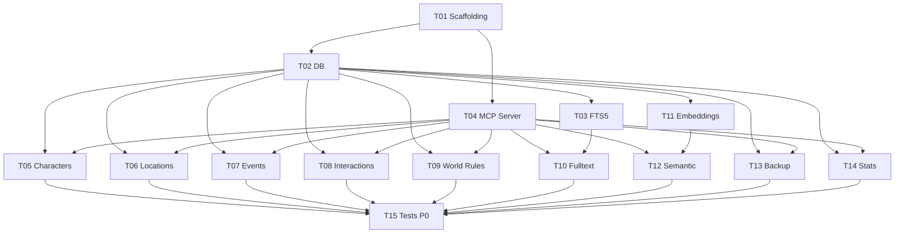

# Team Orchestration — mvp

**Date** : 2026-03-25
**Team name** : `bible-mvp`
**Agents** : 6
**Vagues** : 3
**Mode** : Agent Team (TeamCreate + TaskCreate + Agent tool) + cmux split-pane

## Prerequis

- [ ] Node.js >= 20 installe
- [ ] pnpm installe (`npm install -g pnpm`)
- [ ] Git initialise dans le repo
- [ ] cmux disponible (pour split-pane)

## Lancement

```
Execute le fichier .specs/mvp/team.md
```

L'orchestrateur (toi) lit ce fichier et execute chaque section dans l'ordre.

---

## Etape 0 — Initialisation de la Team

### 0.1 Creer la team

```tool
TeamCreate({
  team_name: "bible-mvp",
  description: "Bible d'Ecrivain MCP — MVP : serveur MCP standalone (stdio) pour gerer une bible d'ecrivain avec CRUD, recherche fulltext FTS5, recherche semantique embeddings, backup/restore."
})
```

### 0.2 Creer toutes les taches (TaskCreate)

Creer les 15 taches P0 **d'un coup** avec leurs dependances via TaskUpdate.

| Task | Subject | Description | Blocked by |
|------|---------|-------------|------------|
| T01 | Scaffolding projet | Init pnpm, package.json (name: bible-ecrivain-mcp, type: module), deps runtime (@modelcontextprotocol/sdk, better-sqlite3, drizzle-orm, zod, @huggingface/transformers), deps dev (typescript, tsx, tsup, vitest, drizzle-kit, eslint, @typescript-eslint/*, prettier, @types/better-sqlite3), tsconfig.json (strict, ESM, ES2022), tsup.config.ts, vitest.config.ts, drizzle.config.ts, .eslintrc.cjs, .prettierrc, .gitignore, structure dossiers (src/db/, src/tools/, src/embeddings/, src/types/, data/, backups/, tests/). Valider `pnpm build`. | — |
| T02 | Couche base de donnees | src/db/schema.ts : schema Drizzle complet (8 tables: characters, locations, events, interactions, world_rules, research, notes, embeddings). src/db/index.ts : getDb(dbPath) ouvre SQLite, active WAL+FK, retourne instance Drizzle. Generer migrations drizzle-kit. | T01 |
| T03 | Index FTS5 et triggers | src/db/fts.ts : table virtuelle bible_fts (FTS5) avec entity_type, entity_id, content. Triggers INSERT/UPDATE/DELETE pour chaque table principale. Le content = concatenation des champs textuels. Exporte initFts(db). | T02 |
| T04 | Bootstrap MCP Server | src/server.ts : McpServer({name: "bible-ecrivain", version}). src/tools/index.ts : pattern registration (chaque tool = {name, description, inputSchema, handler}). src/index.ts : parse --db-path (defaut data/bible.db), init DB, lance server StdioServerTransport. Valider que le serveur demarre et repond a tools/list. | T01 |
| T05 | Tools CRUD Personnages | src/tools/characters.ts : create_character, get_character (par name OU id), update_character, delete_character, list_characters. Unicite du name. Zod schemas. Descriptions en francais. | T02, T04 |
| T06 | Tools CRUD Lieux | src/tools/locations.ts : create_location, get_location (par name OU id), update_location, delete_location, list_locations. Meme pattern que characters. | T02, T04 |
| T07 | Tools CRUD Evenements + Timeline | src/tools/events.ts : create_event (characters[] UUIDs, location_id FK), get_event (enrichi noms persos+lieu), update_event, delete_event, list_events, get_timeline (tri sort_order). sort_order auto-incremente si non fourni. | T02, T04 |
| T08 | Tools CRUD Interactions | src/tools/interactions.ts : create_interaction (min 2 characters[]), get_interaction (enrichi noms), update_interaction, delete_interaction, list_interactions, get_character_relations (toutes interactions d'un perso). | T02, T04 |
| T09 | Tools CRUD Regles du Monde | src/tools/world-rules.ts : create_world_rule (category+title+description obligatoires), get_world_rule, update_world_rule, delete_world_rule, list_world_rules (filtrable par category). | T02, T04 |
| T10 | Recherche Fulltext | src/tools/search.ts : search_fulltext via FTS5 MATCH. Params: query, entity_type?, limit (defaut 10). Retourne: entity_type, entity_id, snippet, rank. Syntaxe FTS5 (prefixes, phrases, booleens). | T03, T04 |
| T11 | Pipeline Embeddings | src/embeddings/model.ts : singleton loadModel() HF Transformers, Xenova/multilingual-e5-base. src/embeddings/index.ts : generateEmbedding(text), indexEntity(type, id, text), removeEntityEmbedding(). src/embeddings/similarity.ts : cosineSimilarity(), topK(). Prefixes E5 "query:"/"passage:". Stockage BLOB SQLite. content_hash anti re-index. | T02 |
| T12 | Recherche Semantique | src/tools/search.ts (ajout) : search_semantic. Params: query, entity_type?, limit (defaut 10), threshold (defaut 0.5). Genere embedding query, topK, filtre threshold, enrichit resultats. | T11, T04 |
| T13 | Backup / Restore | src/tools/backup.ts : backup_bible (copie .db dans backups/ avec timestamp+label), restore_bible (integrity_check, sauvegarde actuelle, remplace), list_backups. Securite: chemin TOUJOURS dans backups/. fs.copyFileSync. | T02, T04 |
| T14 | Stats | src/tools/stats.ts : get_bible_stats = COUNT par table + nb embeddings + taille .db + date modif. Sans parametre. | T02, T04 |
| T15 | Tests P0 | tests/setup.ts : DB :memory:, schema+FTS, helper reset. Tests CRUD complets par domaine. Tests search (fulltext + semantic mock). Tests backup cycle. Tests stats. Tests embeddings (cosine, topK). `pnpm test` passe a 100%. | T05, T06, T07, T08, T09, T10, T12, T13, T14 |

**Procedure :**
1. `TaskCreate` pour chaque tache
2. `TaskUpdate` pour poser les `blockedBy` selon le tableau ci-dessus

---

## Vague 1 — Fondations (1 agent, sequentiel)

### 1.1 Layout cmux

Pas de split necessaire — un seul agent sur le pane principal.

### 1.2 Spawn agent

```tool
Agent({
  name: "fondations",
  team_name: "bible-mvp",
  subagent_type: "general-purpose",
  mode: "auto",
  prompt: "
Tu es l'agent 'fondations' de la team 'bible-mvp'.

Lis ces fichiers pour le contexte :
- CLAUDE.md (conventions du projet)
- .specs/mvp/tasks.md (detail des taches)
- .specs/stack-technique.md (stack retenue)
- .specs/mvp/architecture-technique.md (architecture)

Consulte la TaskList de la team. Tu es owner des taches T01, T02, T04.
Execute-les sequentiellement. Marque chaque tache completed via TaskUpdate.

IMPORTANT :
- Utilise McpServer (API haut niveau v1.28+), PAS Server bas niveau
- Import: @modelcontextprotocol/sdk/server/mcp.js et .../server/stdio.js
- server.registerTool(name, {description, inputSchema}, handler)
- console.error() pour tout log (stdout = JSON-RPC)
- ESM uniquement, imports avec extensions .js
- Modele embedding : Xenova/multilingual-e5-base (768 dim)

Criteres de validation finale :
- pnpm install OK
- pnpm build OK
- Le serveur demarre en stdio et repond a tools/list
"
})
```

### 1.3 Point de synchronisation

Attendre que `fondations` ait termine T01, T02, T04 (les 3 en `completed`).
Les taches T03, T05-T14 sont automatiquement debloquees.

---

## Vague 2 — Features P0 (4 agents paralleles)

### 2.1 Layout cmux — Split 2x2

```bash
# Identifier le pane courant
cmux identify --json

# Split en grille 2x2 pour 4 agents
cmux new-split right --panel pane:1       # pane:1 (gauche) | pane:2 (droite)
cmux new-split down --panel pane:1        # pane:1 (haut-gauche) | pane:3 (bas-gauche)
cmux new-split down --panel pane:2        # pane:2 (haut-droite) | pane:4 (bas-droite)
```

Resultat :
```
+-------------------+-------------------+
| pane:1            | pane:2            |
| crud-alpha        | search-engine     |
+-------------------+-------------------+
| pane:3            | pane:4            |
| crud-beta         | utilities         |
+-------------------+-------------------+
```

### 2.2 Spawn 4 agents en parallele

Les 4 appels `Agent()` doivent etre lances **dans un seul message** pour garantir le parallelisme.

**Agent crud-alpha** (pane:1 — haut-gauche) :
```tool
Agent({
  name: "crud-alpha",
  team_name: "bible-mvp",
  subagent_type: "general-purpose",
  mode: "auto",
  prompt: "
Tu es l'agent 'crud-alpha' de la team 'bible-mvp'.

Lis : CLAUDE.md, .specs/mvp/tasks.md, src/db/schema.ts, src/tools/index.ts

Consulte la TaskList. Tu es owner de T05, T07, T09.

T05 — src/tools/characters.ts
create_character, get_character (name OU id), update_character, delete_character, list_characters.
Unicite du name. Nettoyage embedding sur delete.

T07 — src/tools/events.ts
create_event (characters[] UUIDs, location_id FK), get_event (enrichi), update_event, delete_event, list_events, get_timeline (sort_order). Auto-increment sort_order.

T09 — src/tools/world-rules.ts
create_world_rule, get_world_rule, update_world_rule, delete_world_rule, list_world_rules (filtrable category).

Chaque tool : Zod inputSchema, descriptions en francais, handler async.
Pattern retour : { content: [{ type: 'text', text: JSON.stringify(result) }] }
Erreurs : { isError: true, content: [{ type: 'text', text: message }] }
Enregistre dans src/tools/index.ts.
Marque chaque tache completed via TaskUpdate.
"
})
```

**Agent crud-beta** (pane:3 — bas-gauche) :
```tool
Agent({
  name: "crud-beta",
  team_name: "bible-mvp",
  subagent_type: "general-purpose",
  mode: "auto",
  prompt: "
Tu es l'agent 'crud-beta' de la team 'bible-mvp'.

Lis : CLAUDE.md, .specs/mvp/tasks.md, src/db/schema.ts, src/tools/index.ts
Si src/tools/characters.ts existe, lis-le comme reference de pattern.

Consulte la TaskList. Tu es owner de T06, T08.

T06 — src/tools/locations.ts
create_location, get_location (name OU id), update_location, delete_location, list_locations.
Meme pattern que characters.

T08 — src/tools/interactions.ts
create_interaction (min 2 characters[]), get_interaction (enrichi noms), update_interaction, delete_interaction, list_interactions, get_character_relations (toutes interactions d'un perso, triees sort_order).

Enregistre dans src/tools/index.ts.
Marque chaque tache completed via TaskUpdate.
"
})
```

**Agent search-engine** (pane:2 — haut-droite) :
```tool
Agent({
  name: "search-engine",
  team_name: "bible-mvp",
  subagent_type: "general-purpose",
  mode: "auto",
  prompt: "
Tu es l'agent 'search-engine' de la team 'bible-mvp'.
Tu geres toute la chaine de recherche : FTS5, fulltext, embeddings, semantique.

Lis : CLAUDE.md, .specs/mvp/tasks.md, .specs/mvp/architecture-technique.md, src/db/schema.ts, src/db/index.ts

Consulte la TaskList. Tu es owner de T03, T10, T11, T12.
Execute SEQUENTIELLEMENT (chaque tache debloque la suivante) :

T03 — src/db/fts.ts
Table virtuelle bible_fts (FTS5) : entity_type, entity_id, content.
Triggers INSERT/UPDATE/DELETE pour chaque table (characters, locations, events, interactions, world_rules, research, notes).
Content = concatenation champs textuels. Exporte initFts(db).

T10 — src/tools/search.ts
search_fulltext : MATCH sur bible_fts. Params: query, entity_type?, limit=10.
Retourne: entity_type, entity_id, snippet (highlight), rank. Syntaxe FTS5.

T11 — src/embeddings/
model.ts : singleton pipeline('feature-extraction', 'Xenova/multilingual-e5-base'), { pooling: 'mean', normalize: true }. Dimension 768.
index.ts : generateEmbedding(text), indexEntity(type, id, text), removeEntityEmbedding().
similarity.ts : cosineSimilarity(a,b), topK(queryEmbedding, k, entityType?).
Prefixes: 'query: ' pour requetes, 'passage: ' pour documents.
Stockage BLOB (Float32Array -> Buffer). content_hash.

T12 — src/tools/search.ts (ajout)
search_semantic : query, entity_type?, limit=10, threshold=0.5.
Genere embedding query, topK, filtre threshold, enrichit resultats avec donnees entite.

Marque chaque tache completed via TaskUpdate.
"
})
```

**Agent utilities** (pane:4 — bas-droite) :
```tool
Agent({
  name: "utilities",
  team_name: "bible-mvp",
  subagent_type: "general-purpose",
  mode: "auto",
  prompt: "
Tu es l'agent 'utilities' de la team 'bible-mvp'.

Lis : CLAUDE.md, .specs/mvp/tasks.md, src/db/index.ts, src/tools/index.ts

Consulte la TaskList. Tu es owner de T13, T14.

T13 — src/tools/backup.ts
backup_bible : copie .db dans backups/ avec timestamp (bible_YYYY-MM-DD_HHmmss.db), label optionnel.
restore_bible : PRAGMA integrity_check, sauvegarde bible actuelle, remplace. Echoue proprement si corrompu.
list_backups : fichiers dans backups/ avec date et taille.
Securite : chemin TOUJOURS dans backups/ (path.resolve + startsWith). fs.copyFileSync.

T14 — src/tools/stats.ts
get_bible_stats : COUNT chaque table, nb embeddings, taille .db (fs.statSync), date derniere modif. Sans parametre.

Enregistre dans src/tools/index.ts.
Marque chaque tache completed via TaskUpdate.
"
})
```

### 2.3 Point de synchronisation

Attendre que les 4 agents aient termine toutes leurs taches (T03-T14 en `completed`).

**Conflit attendu** : `src/tools/index.ts` modifie par tous les agents (ajout imports+registration).
Resolution : merge manuel ou auto-merge (ajouts uniquement, pas de conflits de lignes).

---

## Vague 3 — Validation (1 agent)

### 3.1 Layout cmux

Fermer les splits, revenir a un pane unique :
```bash
# Optionnel : fermer les panes extras
# Ou simplement utiliser le pane principal
```

### 3.2 Spawn agent

```tool
Agent({
  name: "tests",
  team_name: "bible-mvp",
  subagent_type: "general-purpose",
  mode: "auto",
  prompt: "
Tu es l'agent 'tests' de la team 'bible-mvp'.

Lis : CLAUDE.md, .specs/mvp/tasks.md, puis TOUS les fichiers src/ pour comprendre l'implementation.

Consulte la TaskList. Tu es owner de T15.

T15 — Tests P0

1. tests/setup.ts : DB en memoire (:memory:), schema Drizzle + initFts(), helper reset entre tests.

2. Tests CRUD (tests/tools/*.test.ts) pour chaque domaine :
   - create -> get -> update -> get (verifie changement) -> delete -> get (verifie erreur)
   - list : creer 3 entites -> list -> verifier count
   - Unicite : creer doublon -> verifier erreur
   - Erreurs : get/update/delete sur ID inexistant

3. Tests search (tests/tools/search.test.ts) :
   - Fulltext : creer entites -> search -> resultats pertinents
   - Fulltext : recherche sans resultat -> tableau vide
   - Semantique : mock embeddings (vecteurs deterministes), verifier ranking
   - Semantique : threshold -> resultats filtres

4. Tests backup (tests/tools/backup.test.ts) :
   - Cycle : backup -> modifier -> restore -> verifier donnees restaurees
   - list_backups -> verifier presence

5. Tests stats (tests/tools/stats.test.ts) :
   - Bible vide -> compteurs a 0
   - Ajouter entites -> compteurs corrects

6. Tests embeddings (tests/embeddings/*.test.ts) :
   - cosineSimilarity : vecteurs identiques -> 1.0, orthogonaux -> 0.0
   - topK : retourne les K plus proches, tries

Verifie `pnpm test` passe a 100%.
Marque T15 completed via TaskUpdate.
"
})
```

### 3.3 Fin

Quand T15 est `completed` :
1. Verifier `pnpm test` et `pnpm build` une derniere fois
2. Shutdown tous les agents : `SendMessage({ to: "*", message: { type: "shutdown_request" } })`
3. Cleanup : `TeamDelete()`

---

## Annexe — Resume agents et taches

| Agent | Type | Taches | Pane (Vague 2) |
|-------|------|--------|----------------|
| fondations | general-purpose | T01, T02, T04 | principal |
| crud-alpha | general-purpose | T05, T07, T09 | haut-gauche |
| crud-beta | general-purpose | T06, T08 | bas-gauche |
| search-engine | general-purpose | T03, T10, T11, T12 | haut-droite |
| utilities | general-purpose | T13, T14 | bas-droite |
| tests | general-purpose | T15 | principal |

## Annexe — Graphe de dependances


