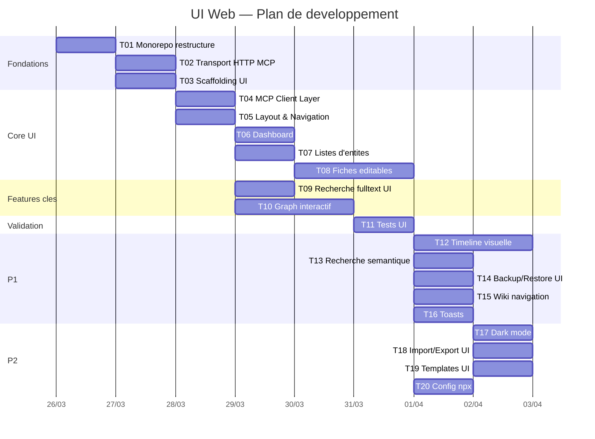

# Plan de developpement — ui-web

**Date** : 2026-03-26
**Contexte** : architecture-technique.md, stack-technique.md

## Vue d'ensemble

```
+-------------------------------------------------------+
|               Navigateur (React SPA)                  |
|                                                        |
|  [Dashboard] [Entities] [Graph] [Timeline] [Search]  |
|       |           |        |        |          |      |
|       +-----+-----+--------+--------+----------+     |
|             |                                          |
|      [MCP Client Layer — fetch JSON-RPC]              |
+-------------|-----------------------------------------+
              | HTTP (localhost:3000)
+-------------v-----------------------------------------+
|           Node.js Server (unique process)             |
|                                                        |
|  [Express]  GET /*     --> UI statique (public/)      |
|             POST /mcp  --> MCP StreamableHTTP         |
|                                                        |
|  [MCP Server — 47 tools existants]                    |
|                                                        |
|  [SQLite — bible.db]                                  |
+-------------------------------------------------------+
```

## Structure du projet

Voir architecture-technique.md section "Structure du projet" pour l'arborescence complete.

## Frontend — Architecture

### Routing (React Router)
| Route | Page | Description |
|-------|------|-------------|
| `/` | Dashboard | Stats, acces rapide, etat de la bible |
| `/characters` | Characters | Liste + CRUD personnages |
| `/characters/:id` | CharacterDetail | Fiche editable |
| `/locations` | Locations | Liste + CRUD lieux |
| `/locations/:id` | LocationDetail | Fiche editable |
| `/events` | Events | Liste + timeline |
| `/events/:id` | EventDetail | Fiche editable |
| `/interactions` | Interactions | Liste interactions |
| `/interactions/:id` | InteractionDetail | Fiche editable |
| `/world-rules` | WorldRules | Liste regles du monde |
| `/world-rules/:id` | WorldRuleDetail | Fiche editable |
| `/research` | Research | Liste recherches |
| `/notes` | Notes | Liste notes |
| `/graph` | Graph | Graph interactif full-page |
| `/timeline` | Timeline | Timeline visuelle |
| `/search` | Search | Recherche fulltext + semantique |
| `/backups` | Backups | Gestion sauvegardes |

### State management
- **React Query (TanStack Query)** pour le data fetching + cache + invalidation
- Pas de store global (Redux/Zustand) — les donnees viennent du MCP, React Query gere le cache
- Invalidation automatique : apres un create/update/delete, invalider les queries concernees

### MCP Client Layer
```
api/mcp-client.ts :
  callTool(name, params) --> POST /mcp (JSON-RPC)
  Retourne le contenu parse (JSON.parse du text block)
  Gestion d'erreurs (isError, network errors)

hooks/useMcp.ts :
  useMcpQuery(toolName, params) --> React Query wrapper
  useMcpMutation(toolName) --> mutation + invalidation
```

## Phases de developpement

### P0 — MVP UI
| # | Tache | Detail |
|---|-------|--------|
| 1 | Restructuration monorepo | Deplacer le code dans packages/mcp/, creer workspace root |
| 2 | Transport HTTP pour MCP | Ajouter mode --ui qui lance HTTP + sert l'UI statique |
| 3 | Scaffolding UI | Vite + React + Tailwind + React Router + React Query |
| 4 | MCP Client Layer | Wrapper fetch JSON-RPC + hooks React Query |
| 5 | Layout & Navigation | Sidebar, header, routing |
| 6 | Dashboard | Stats bible, acces rapide aux entites |
| 7 | Listes d'entites | Vues liste pour les 7 types, avec compteurs |
| 8 | Fiches editables | Detail + formulaire d'edition pour chaque type |
| 9 | Recherche fulltext UI | Barre de recherche, resultats, navigation |
| 10 | Graph interactif | Cytoscape.js force-directed, noeuds, liens, clic, zoom |
| 11 | Tests UI | Tests composants + integration MCP client |

### P1 — Confort UI
| # | Tache | Detail |
|---|-------|--------|
| 12 | Timeline visuelle | Axe chronologique, filtres, drag & drop reordonnement |
| 13 | Recherche semantique UI | Toggle fulltext/semantic, seuil configurable |
| 14 | Backup/Restore UI | Liste backups, boutons backup/restore, confirmation |
| 15 | Wiki-style navigation | Clic sur un nom d'entite dans une fiche --> navigation vers sa fiche |
| 16 | Notifications / Toasts | Feedback visuel sur les actions CRUD |

### P2 — Nice-to-have UI
| # | Tache | Detail |
|---|-------|--------|
| 17 | Dark mode / theming | Toggle clair/sombre, persistance localStorage |
| 18 | Import/Export UI | Formulaire import JSON, bouton export Markdown |
| 19 | Templates UI | Choix genre + type, pre-remplissage formulaire |
| 20 | Config barda npx | `npx barda-ecrivain-bible` ouvre navigateur, config integree |

## Tests
- **Composants** : vitest + @testing-library/react pour les composants UI
- **MCP Client** : mock du fetch, verification JSON-RPC
- **Integration** : tests E2E legers (lancer le serveur HTTP, verifier que l'UI charge et appelle les tools)
- **Prioritaire P0** : MCP client layer, formulaires CRUD, graph rendering

## Ordre d'execution



## Checklist de lancement
- [ ] pnpm workspaces configure
- [ ] `pnpm build` compile mcp + ui sans erreur
- [ ] `pnpm --filter mcp test` passe (tests MCP existants)
- [ ] Le serveur HTTP sert l'UI + repond aux tools MCP
- [ ] Le graph affiche les entites d'une bible de test
- [ ] `npx barda-ecrivain-bible` fonctionne
