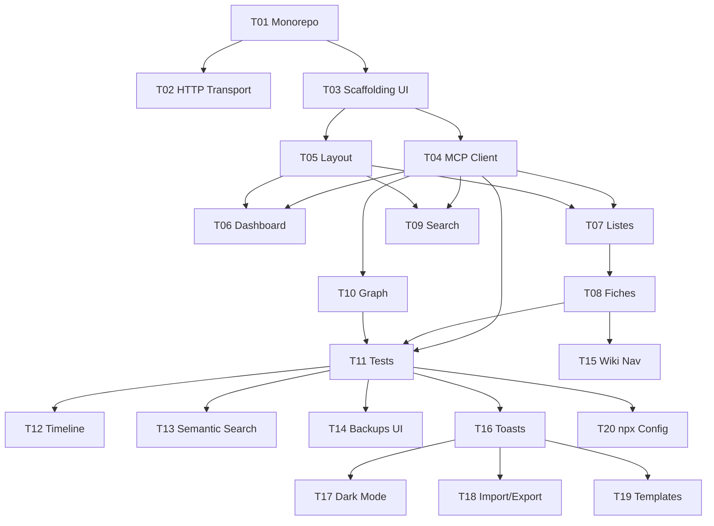

# Taches — ui-web

**Date** : 2026-03-26
**Nombre de taches** : 20
**Phases** : P0 (11 taches), P1 (5 taches), P2 (4 taches)

## Taches

### T01 · Restructuration monorepo

**Phase** : P0
**But** : Reorganiser le projet en monorepo pnpm workspaces avec packages/mcp/ et packages/ui/.

**Fichiers concernes** :
- `[NEW]` `pnpm-workspace.yaml`
- `[NEW]` `packages/mcp/` (tout le code existant deplace)
- `[NEW]` `packages/ui/` (dossier vide pour l'instant)
- `[MODIFY]` `package.json` (workspace root)
- `[MODIFY]` `packages/mcp/package.json` (ancien package.json adapte)
- `[MODIFY]` `packages/mcp/tsconfig.json`
- `[MODIFY]` `packages/mcp/tsup.config.ts`
- `[MODIFY]` `packages/mcp/drizzle.config.ts`
- `[MODIFY]` `packages/mcp/vitest.config.ts`

**Piste** : infra

**Dependances** : aucune

**Criteres d'acceptation** :
- [ ] pnpm-workspace.yaml cree avec packages: ["packages/*"]
- [ ] Tout le code src/, tests/, data/, backups/ deplace dans packages/mcp/
- [ ] package.json racine : scripts `build`, `test`, `dev` qui delegent aux workspaces
- [ ] `pnpm install` fonctionne depuis la racine
- [ ] `pnpm --filter mcp build` compile sans erreur
- [ ] `pnpm --filter mcp test` passe (61 tests existants)
- [ ] Les chemins d'imports sont corrects apres deplacement
- [ ] .specs/, CLAUDE.md, README.md, documentation/ restent a la racine

---

### T02 · Transport HTTP pour le MCP

**Phase** : P0
**But** : Ajouter un mode de lancement HTTP qui sert les tools MCP via HTTP et le bundle UI statique.

**Fichiers concernes** :
- `[NEW]` `packages/mcp/src/http.ts`
- `[MODIFY]` `packages/mcp/src/index.ts`
- `[MODIFY]` `packages/mcp/package.json` (ajout dep express ou http natif)

**Piste** : backend

**Dependances** : T01

**Criteres d'acceptation** :
- [ ] `--ui` flag lance le serveur en mode HTTP (au lieu de stdio)
- [ ] `--port` optionnel (defaut 3000)
- [ ] Le serveur HTTP ecoute sur 127.0.0.1 uniquement
- [ ] POST /mcp accepte des requetes JSON-RPC et les route vers le MCP Server
- [ ] GET /* sert les fichiers statiques depuis le dossier public/ (si existe)
- [ ] Sans `--ui`, le comportement stdio est inchange (retro-compatible)
- [ ] Le serveur affiche l'URL dans le terminal : "Bible UI disponible sur http://localhost:3000"
- [ ] Tente d'ouvrir le navigateur automatiquement (open/xdg-open/start)
- [ ] Test : curl POST /mcp avec tools/list retourne la liste des tools

---

### T03 · Scaffolding UI

**Phase** : P0
**But** : Initialiser le projet React + Vite + Tailwind + React Router + React Query.

**Fichiers concernes** :
- `[NEW]` `packages/ui/package.json`
- `[NEW]` `packages/ui/vite.config.ts`
- `[NEW]` `packages/ui/tailwind.config.ts`
- `[NEW]` `packages/ui/tsconfig.json`
- `[NEW]` `packages/ui/index.html`
- `[NEW]` `packages/ui/src/main.tsx`
- `[NEW]` `packages/ui/src/App.tsx`
- `[NEW]` `packages/ui/src/styles/globals.css`

**Piste** : frontend

**Dependances** : T01

**Criteres d'acceptation** :
- [ ] `pnpm --filter ui dev` lance Vite dev server
- [ ] `pnpm --filter ui build` produit un bundle statique dans packages/ui/dist/
- [ ] React Router configure avec routes vides (placeholder pages)
- [ ] React Query provider configure
- [ ] Tailwind CSS fonctionne
- [ ] Vite proxy configure : /mcp --> http://localhost:3000/mcp (pour dev)
- [ ] Script de build copie packages/ui/dist/ --> packages/mcp/public/ pour production

---

### T04 · MCP Client Layer

**Phase** : P0
**But** : Creer le wrapper fetch JSON-RPC et les hooks React Query pour appeler les tools MCP.

**Fichiers concernes** :
- `[NEW]` `packages/ui/src/api/mcp-client.ts`
- `[NEW]` `packages/ui/src/hooks/useMcp.ts`
- `[NEW]` `packages/ui/src/types/index.ts`

**Piste** : frontend

**Dependances** : T03

**Criteres d'acceptation** :
- [ ] `callTool(name, params)` envoie un POST JSON-RPC au /mcp et retourne le resultat parse
- [ ] Gestion d'erreurs : isError du MCP, erreurs reseau, timeout
- [ ] `useMcpQuery(toolName, params)` : React Query wrapper pour les lectures (get, list, search)
- [ ] `useMcpMutation(toolName, invalidateKeys)` : mutation + invalidation cache
- [ ] Types TypeScript pour les entites (Character, Location, Event, etc.)
- [ ] Test unitaire : mock fetch, verifier le format JSON-RPC

---

### T05 · Layout et Navigation

**Phase** : P0
**But** : Creer la structure visuelle de l'application : sidebar, header, routing.

**Fichiers concernes** :
- `[NEW]` `packages/ui/src/components/layout/Sidebar.tsx`
- `[NEW]` `packages/ui/src/components/layout/Header.tsx`
- `[NEW]` `packages/ui/src/components/layout/Layout.tsx`
- `[MODIFY]` `packages/ui/src/App.tsx`

**Piste** : frontend

**Dependances** : T03

**Criteres d'acceptation** :
- [ ] Sidebar avec liens vers toutes les sections (Dashboard, Personnages, Lieux, Evenements, Interactions, Regles, Recherches, Notes, Graph, Timeline, Recherche, Backups)
- [ ] Header avec nom de la bible + barre de recherche rapide
- [ ] Layout responsive (sidebar collapsible sur petit ecran)
- [ ] Route active surlignee dans la sidebar
- [ ] Navigation fluide (pas de rechargement de page)

---

### T06 · Dashboard

**Phase** : P0
**But** : Page d'accueil avec statistiques de la bible et acces rapides.

**Fichiers concernes** :
- `[NEW]` `packages/ui/src/pages/Dashboard.tsx`
- `[NEW]` `packages/ui/src/components/dashboard/StatCard.tsx`
- `[NEW]` `packages/ui/src/components/dashboard/QuickActions.tsx`

**Piste** : frontend

**Dependances** : T04, T05

**Criteres d'acceptation** :
- [ ] Appelle get_bible_stats au chargement
- [ ] Affiche les compteurs par type d'entite (personnages, lieux, evenements, etc.)
- [ ] Affiche la taille de la bible et la date de derniere modification
- [ ] Boutons d'acces rapide : "Nouveau personnage", "Nouveau lieu", "Backup"
- [ ] Lien vers le graph
- [ ] Etat vide : message d'accueil si la bible est vide

---

### T07 · Listes d'entites

**Phase** : P0
**But** : Pages de liste pour les 7 types d'entites avec bouton de creation.

**Fichiers concernes** :
- `[NEW]` `packages/ui/src/pages/Characters.tsx`
- `[NEW]` `packages/ui/src/pages/Locations.tsx`
- `[NEW]` `packages/ui/src/pages/Events.tsx`
- `[NEW]` `packages/ui/src/pages/Interactions.tsx`
- `[NEW]` `packages/ui/src/pages/WorldRules.tsx`
- `[NEW]` `packages/ui/src/pages/Research.tsx`
- `[NEW]` `packages/ui/src/pages/Notes.tsx`
- `[NEW]` `packages/ui/src/components/entities/EntityList.tsx`
- `[NEW]` `packages/ui/src/components/entities/EntityCard.tsx`

**Piste** : frontend

**Dependances** : T04, T05

**Criteres d'acceptation** :
- [ ] Chaque page appelle list_[type] et affiche les entites en cartes
- [ ] Bouton "Creer" en haut de chaque liste
- [ ] Clic sur une carte --> navigation vers la fiche detail
- [ ] Pagination si > 50 entites
- [ ] Composant EntityList generique reutilisable pour tous les types
- [ ] Etat vide : message + bouton de creation

---

### T08 · Fiches editables

**Phase** : P0
**But** : Pages de detail avec formulaire d'edition pour chaque type d'entite.

**Fichiers concernes** :
- `[NEW]` `packages/ui/src/pages/CharacterDetail.tsx`
- `[NEW]` `packages/ui/src/pages/LocationDetail.tsx`
- `[NEW]` `packages/ui/src/pages/EventDetail.tsx`
- `[NEW]` `packages/ui/src/pages/InteractionDetail.tsx`
- `[NEW]` `packages/ui/src/pages/WorldRuleDetail.tsx`
- `[NEW]` `packages/ui/src/pages/ResearchDetail.tsx`
- `[NEW]` `packages/ui/src/pages/NoteDetail.tsx`
- `[NEW]` `packages/ui/src/components/entities/EntityForm.tsx`
- `[NEW]` `packages/ui/src/components/common/ConfirmDialog.tsx`

**Piste** : frontend

**Dependances** : T07

**Criteres d'acceptation** :
- [ ] Mode lecture par defaut, bouton "Editer" pour passer en mode edition
- [ ] Formulaire avec tous les champs du type (textarea pour les champs longs)
- [ ] Sauvegarde appelle update_[type] via MCP, invalide le cache
- [ ] Mode creation : formulaire vide, appelle create_[type]
- [ ] Bouton "Supprimer" avec confirmation (dialog)
- [ ] Pour events et interactions : selecteurs de personnages et lieux (dropdown avec search)
- [ ] Affichage des timestamps (created_at, updated_at) en lecture

---

### T09 · Recherche fulltext UI

**Phase** : P0
**But** : Barre de recherche globale + page de resultats avec navigation.

**Fichiers concernes** :
- `[NEW]` `packages/ui/src/pages/Search.tsx`
- `[NEW]` `packages/ui/src/components/search/SearchBar.tsx`
- `[NEW]` `packages/ui/src/components/search/SearchResults.tsx`

**Piste** : frontend

**Dependances** : T04, T05

**Criteres d'acceptation** :
- [ ] Barre de recherche dans le header (toujours visible)
- [ ] Debounce 300ms avant envoi
- [ ] Appelle search_fulltext avec la query
- [ ] Resultats groupes par type d'entite
- [ ] Snippet avec surbrillance du terme cherche
- [ ] Clic sur un resultat --> navigation vers la fiche
- [ ] Filtre par type d'entite (optionnel)
- [ ] Etat vide : "Aucun resultat pour [query]"

---

### T10 · Graph interactif

**Phase** : P0
**But** : Vue graph force-directed avec @react-sigma/core (Sigma.js) montrant toutes les entites et leurs relations.

**Fichiers concernes** :
- `[NEW]` `packages/ui/src/pages/Graph.tsx`
- `[NEW]` `packages/ui/src/components/graph/GraphView.tsx`
- `[NEW]` `packages/ui/src/components/graph/GraphControls.tsx`
- `[NEW]` `packages/ui/src/components/graph/GraphLegend.tsx`
- `[NEW]` `packages/ui/src/hooks/useGraph.ts`

**Piste** : frontend

**Dependances** : T04

**Criteres d'acceptation** :
- [ ] Charge toutes les entites (list_characters, list_locations, list_events, list_interactions, list_world_rules) au montage
- [ ] Construit le graph : noeuds = entites, liens = relations (interactions characters[], events characters[], events location_id)
- [ ] Noeuds colores par type (personnage = bleu, lieu = vert, evenement = orange, etc.)
- [ ] Layout force-directed (cose ou fcose pour cytoscape)
- [ ] Zoom, pan, drag des noeuds
- [ ] Clic sur un noeud : panneau lateral avec resume de la fiche + lien "Voir la fiche"
- [ ] Clic sur un lien : detail de l'interaction/relation
- [ ] Filtrage par type d'entite (toggle checkboxes)
- [ ] Legende des couleurs
- [ ] Performant avec 500 noeuds (pas de freeze)

---

### T11 · Tests UI

**Phase** : P0
**But** : Tests pour les composants critiques et le MCP client layer.

**Fichiers concernes** :
- `[NEW]` `packages/ui/src/api/__tests__/mcp-client.test.ts`
- `[NEW]` `packages/ui/src/hooks/__tests__/useMcp.test.ts`
- `[NEW]` `packages/ui/src/components/__tests__/EntityForm.test.tsx`
- `[NEW]` `packages/ui/src/components/__tests__/GraphView.test.tsx`

**Piste** : frontend

**Dependances** : T04, T08, T10

**Criteres d'acceptation** :
- [ ] MCP Client : mock fetch, verifier format JSON-RPC, gestion erreurs
- [ ] useMcp hooks : mock client, verifier cache invalidation
- [ ] EntityForm : render + soumission, validation champs requis
- [ ] GraphView : render avec donnees mock, verifier que cytoscape s'initialise
- [ ] `pnpm --filter ui test` passe

---

### T12 · Timeline visuelle

**Phase** : P1
**But** : Vue timeline chronologique avec filtres et drag & drop pour reordonner.

**Fichiers concernes** :
- `[NEW]` `packages/ui/src/pages/Timeline.tsx`
- `[NEW]` `packages/ui/src/components/timeline/TimelineView.tsx`
- `[NEW]` `packages/ui/src/components/timeline/TimelineEvent.tsx`
- `[NEW]` `packages/ui/src/components/timeline/TimelineFilters.tsx`

**Piste** : frontend

**Dependances** : T11

**Criteres d'acceptation** :
- [ ] Axe vertical chronologique (sort_order)
- [ ] Chaque evenement : titre, chapitre, personnages (badges), lieu
- [ ] Filtres : par personnage (dropdown), par lieu, par plage de chapitres
- [ ] Drag & drop pour reordonner (modifie sort_order via update_event)
- [ ] Clic sur un evenement --> navigation vers la fiche

---

### T13 · Recherche semantique UI

**Phase** : P1
**But** : Ajouter la recherche semantique dans l'UI avec toggle fulltext/semantic.

**Fichiers concernes** :
- `[MODIFY]` `packages/ui/src/pages/Search.tsx`
- `[MODIFY]` `packages/ui/src/components/search/SearchBar.tsx`

**Piste** : frontend

**Dependances** : T11

**Criteres d'acceptation** :
- [ ] Toggle "Recherche exacte" / "Recherche par sens" dans la barre
- [ ] Mode semantique appelle search_semantic
- [ ] Affiche le score de similarite a cote de chaque resultat
- [ ] Slider pour le seuil (threshold) avec valeur affichee
- [ ] Message explicatif si aucun embedding n'existe encore

---

### T14 · Backup/Restore UI

**Phase** : P1
**But** : Interface de gestion des sauvegardes.

**Fichiers concernes** :
- `[NEW]` `packages/ui/src/pages/Backups.tsx`
- `[NEW]` `packages/ui/src/components/backup/BackupList.tsx`

**Piste** : frontend

**Dependances** : T11

**Criteres d'acceptation** :
- [ ] Bouton "Sauvegarder maintenant" (avec label optionnel)
- [ ] Liste des backups existants (date, taille, label)
- [ ] Bouton "Restaurer" par backup avec dialog de confirmation
- [ ] Feedback : toast de succes/erreur
- [ ] Apres restauration : recharger toutes les donnees UI

---

### T15 · Wiki-style navigation

**Phase** : P1
**But** : Rendre les noms d'entites cliquables dans les fiches pour naviguer entre elles.

**Fichiers concernes** :
- `[NEW]` `packages/ui/src/components/common/EntityLink.tsx`
- `[MODIFY]` `packages/ui/src/pages/EventDetail.tsx`
- `[MODIFY]` `packages/ui/src/pages/InteractionDetail.tsx`

**Piste** : frontend

**Dependances** : T08

**Criteres d'acceptation** :
- [ ] Composant EntityLink : affiche le nom en lien cliquable, couleur par type
- [ ] Dans EventDetail : noms des personnages et du lieu sont des EntityLink
- [ ] Dans InteractionDetail : noms des personnages sont des EntityLink
- [ ] Hover : tooltip avec resume de l'entite (description tronquee)
- [ ] Navigation sans rechargement

---

### T16 · Notifications / Toasts

**Phase** : P1
**But** : Feedback visuel sur les actions CRUD (creation, modification, suppression, erreurs).

**Fichiers concernes** :
- `[NEW]` `packages/ui/src/components/common/Toaster.tsx`
- `[NEW]` `packages/ui/src/hooks/useToast.ts`
- `[MODIFY]` `packages/ui/src/App.tsx` (ajout Toaster provider)

**Piste** : frontend

**Dependances** : T11

**Criteres d'acceptation** :
- [ ] Toast succes (vert) : "Personnage cree", "Fiche mise a jour", etc.
- [ ] Toast erreur (rouge) : "Nom deja utilise", "Erreur de connexion", etc.
- [ ] Auto-dismiss apres 3s
- [ ] Position : coin bas droit
- [ ] Empilable (plusieurs toasts simultanes)

---

### T17 · Dark mode / theming

**Phase** : P2
**But** : Toggle clair/sombre avec persistance.

**Fichiers concernes** :
- `[NEW]` `packages/ui/src/hooks/useTheme.ts`
- `[MODIFY]` `packages/ui/src/components/layout/Header.tsx` (toggle)
- `[MODIFY]` `packages/ui/tailwind.config.ts` (dark mode class)
- `[MODIFY]` `packages/ui/src/styles/globals.css`

**Piste** : frontend

**Dependances** : T16

**Criteres d'acceptation** :
- [ ] Toggle dans le header (icone soleil/lune)
- [ ] Tailwind dark mode via classe `dark` sur html
- [ ] Persistance dans localStorage
- [ ] Le graph s'adapte (couleurs de fond, noeuds)

---

### T18 · Import/Export UI

**Phase** : P2
**But** : Interface pour l'import JSON et l'export Markdown.

**Fichiers concernes** :
- `[NEW]` `packages/ui/src/pages/ImportExport.tsx`

**Piste** : frontend

**Dependances** : T16

**Criteres d'acceptation** :
- [ ] Export : bouton "Exporter en Markdown" appelle export_bible, propose le telechargement
- [ ] Export filtre : dropdown pour choisir un type d'entite
- [ ] Import : zone de drop ou bouton fichier pour un JSON, appelle import_bulk
- [ ] Preview avant import : affiche le nombre d'entites par type
- [ ] Choix on_conflict (skip/update) avant import

---

### T19 · Templates UI

**Phase** : P2
**But** : Interface pour utiliser les templates de fiches par genre.

**Fichiers concernes** :
- `[MODIFY]` `packages/ui/src/pages/CharacterDetail.tsx` (bouton "Utiliser un template")
- `[MODIFY]` `packages/ui/src/pages/LocationDetail.tsx`
- `[MODIFY]` `packages/ui/src/pages/WorldRuleDetail.tsx`
- `[NEW]` `packages/ui/src/components/common/TemplateSelector.tsx`

**Piste** : frontend

**Dependances** : T16

**Criteres d'acceptation** :
- [ ] Bouton "Utiliser un template" dans le formulaire de creation
- [ ] Modal : choix du genre (fantasy, polar, sf, historique, romance)
- [ ] Appelle get_template, pre-remplit le formulaire
- [ ] L'auteur peut modifier avant de sauvegarder

---

### T20 · Config barda et npx

**Phase** : P2
**But** : Configurer le package pour distribution via npx et inclure la config barda.

**Fichiers concernes** :
- `[MODIFY]` `packages/mcp/package.json` (bin, files, publishConfig)
- `[NEW]` `packages/mcp/barda.json` (config barda ecrivain)
- `[MODIFY]` `packages/mcp/src/index.ts` (auto-open browser)

**Piste** : infra

**Dependances** : T11

**Criteres d'acceptation** :
- [ ] `npx barda-ecrivain-bible` installe et lance en mode --ui
- [ ] Le navigateur s'ouvre automatiquement sur http://localhost:3000
- [ ] barda.json contient la config MCP pour Cruchot (command, args, transportType)
- [ ] Le package npm inclut : dist/ (MCP compile) + public/ (UI compile) + barda.json
- [ ] README mis a jour avec instructions npx

---

## Graphe de dependances



## Indicateurs de parallelisme

### Pistes identifiees

| Piste | Taches | Repertoire |
|-------|--------|------------|
| infra | T01, T20 | racine, packages/mcp/ |
| backend | T02 | packages/mcp/src/ |
| frontend-core | T03, T04, T05, T06, T07, T08 | packages/ui/src/ |
| frontend-features | T09, T10, T12, T13, T14 | packages/ui/src/ |
| frontend-polish | T15, T16, T17, T18, T19 | packages/ui/src/ |

### Fichiers partages entre pistes

| Fichier | Taches | Risque de conflit |
|---------|--------|-------------------|
| packages/ui/src/App.tsx | T05, T16 | Faible — ajouts de routes et providers |
| packages/mcp/src/index.ts | T02 | Nul — T02 seul modifie ce fichier |

### Chemin critique

```
T01 --> T03 --> T04 --> T10 --> T11
```

Le graph interactif (T10) est le composant le plus complexe et sur le chemin critique.
