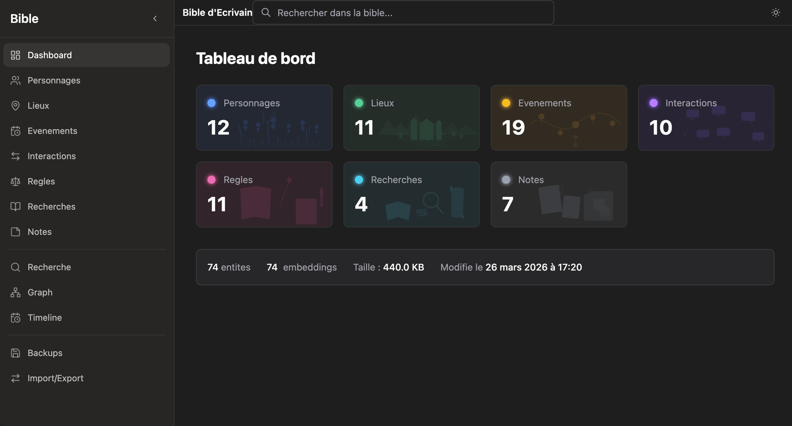
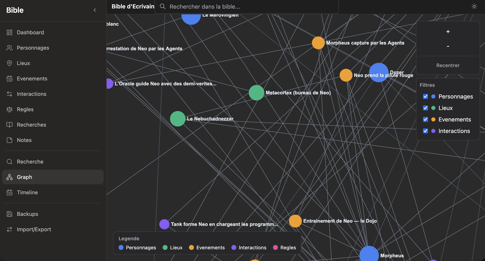
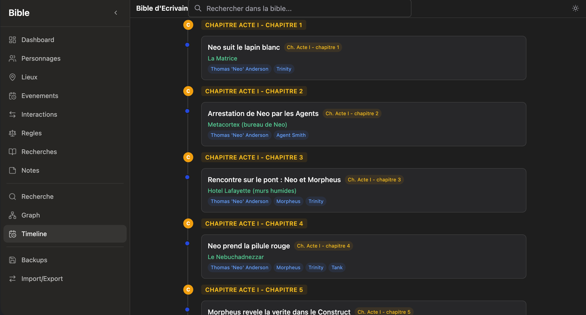

# Bible d'Ecrivain MCP

Serveur MCP standalone pour gerer une **bible d'ecrivain** — une base de connaissances structuree et cherchable d'un univers narratif.

La bible centralise personnages, lieux, evenements, interactions, regles du monde, recherches et notes. Deux interfaces : **outils MCP** pour les agents IA, et **UI web** pour l'humain.

```
"Bob portait des lunettes a l'eglise du chateau ?"
  --> L'agent interroge la bible
  --> "Oui, Bob portait encore ses lunettes au chapitre 6.
       Il ne s'est fait operer qu'au chapitre 9."
```

## Interface web



Le dashboard affiche les statistiques de la bible avec des cartes illustrees par type d'entite.



Le graph relationnel permet d'explorer visuellement les connexions entre personnages, lieux, evenements et interactions. Cliquer sur un noeud affiche ses details et ses connexions dans un panneau lateral.



La timeline affiche les evenements dans l'ordre narratif, avec les personnages et lieux associes.

## Installation

**Prerequis :** Node.js >= 20, pnpm

```bash
git clone <url>
cd barda-mcp-ecrivain-bible
pnpm install
pnpm build
```

> Au premier lancement, le modele d'embeddings (~200 MB) est telecharge automatiquement depuis HuggingFace. C'est une operation unique.

## Utilisation

### Mode UI (web)

```bash
pnpm dev        # Dev : MCP HTTP + UI Vite (hot reload)
pnpm start      # Prod : MCP HTTP + UI statique sur http://localhost:3000
```

### Mode MCP (stdio)

```bash
pnpm dev:mcp    # Dev : MCP stdio (pour agents IA)
```

## Configuration MCP

### Claude Desktop

Ajouter dans `claude_desktop_config.json` :

```json
{
  "mcpServers": {
    "bible-ecrivain": {
      "command": "node",
      "args": ["/chemin/vers/barda-mcp-ecrivain-bible/packages/mcp/dist/index.js"]
    }
  }
}
```

### Claude Code

Ajouter dans les settings MCP :

```json
{
  "bible-ecrivain": {
    "command": "node",
    "args": ["/chemin/vers/barda-mcp-ecrivain-bible/packages/mcp/dist/index.js"]
  }
}
```

### Cruchot (barda)

Ajouter la definition dans la configuration barda :

```json
{
  "command": "node",
  "args": ["/chemin/vers/barda-mcp-ecrivain-bible/packages/mcp/dist/index.js"],
  "transportType": "stdio"
}
```

### Base de donnees personnalisee

Par defaut, la bible est stockee dans `packages/mcp/data/bible.db`. Pour utiliser un autre chemin :

```json
"args": ["/chemin/vers/dist/index.js", "--db-path", "/chemin/vers/ma-bible.db"]
```

## Fonctionnalites

| Domaine | Tools | Description |
|---------|-------|-------------|
| Personnages | 5 | Fiches completes (physique, personnalite, background) |
| Lieux | 5 | Descriptions, atmosphere, geographie |
| Evenements | 7 | Timeline narrative, chronologie, filtres avances |
| Interactions | 6 | Relations entre personnages, reseau relationnel |
| Regles du Monde | 5 | Magie, technologie, societe, religion... |
| Recherches | 5 | Notes de recherche documentaire avec sources |
| Notes | 5 | Notes libres avec tags |
| Recherche | 2 | Fulltext (FTS5) + semantique (embeddings) |
| Export / Import | 2 | Markdown structure + import JSON massif |
| Embeddings | 1 | Re-indexation batch (reindex_embeddings) |
| Utilitaires | 5 | Backup/restore, stats, doublons, templates |
| **Total** | **48** | |

La **recherche semantique** retrouve l'information par le sens, pas juste par les mots exacts. Ideal pour les questions floues comme *"je sais plus si Bob avait des problemes de vue"*.

> Pour la documentation complete de chaque outil avec parametres et exemples, voir [documentation/mcp.md](documentation/mcp.md).

## Architecture

```
UI React (navigateur)                   Agent IA (Claude / Cruchot)
+-------------------+                   +---------------------+
| Dashboard, Graph  |                   | LLM = intelligence  |
| Timeline, CRUD    |                   | Analyse, comprend,  |
| Recherche         |                   | decide quoi stocker |
+--------+----------+                   +----------+----------+
         |                                         |
    HTTP POST /mcp                            stdio JSON-RPC
    (JSON-RPC)                                     |
         |                                         |
         v                                         v
+----------------------------------------------------------+
|                  Bible MCP (ce serveur)                   |
|                                                          |
|  McpServer  -->  48 tools  -->  Drizzle ORM  -->  SQLite |
|                                  FTS5 + Embeddings       |
|                              (1 seul fichier .db)        |
+----------------------------------------------------------+
```

- **Le client** (LLM ou UI) interroge la bible via les memes outils MCP.
- **La bible** est la memoire : elle stocke, indexe, et retrouve. Pas de LLM embarque.
- **Un seul fichier** `bible.db` = toute la bible. Backup = copier ce fichier.

## Stack technique

| Brique | Choix |
|--------|-------|
| Runtime | Node.js >= 20, TypeScript (strict) |
| MCP | @modelcontextprotocol/sdk (stdio + HTTP) |
| DB | SQLite via better-sqlite3 + Drizzle ORM |
| Fulltext | SQLite FTS5 |
| Embeddings | @huggingface/transformers (Xenova/multilingual-e5-base, local) |
| UI | React 19, Vite, Tailwind CSS 4, TanStack Query, Sigma.js |
| Tests | vitest (90 tests : 61 MCP + 29 UI) |
| Build | tsup (MCP) + Vite (UI), monorepo pnpm workspaces |

## Developpement

```bash
pnpm dev              # MCP HTTP + UI (dev complet)
pnpm dev:mcp          # MCP stdio uniquement
pnpm dev:ui           # UI Vite dev server (proxy vers MCP)
pnpm build            # Build production (MCP + UI)
pnpm test             # Tous les tests (90)
pnpm --filter @barda/mcp test   # Tests MCP (61)
pnpm --filter @barda/ui test    # Tests UI (29)
```

## Licence

MIT
